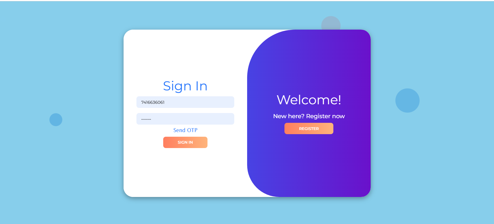
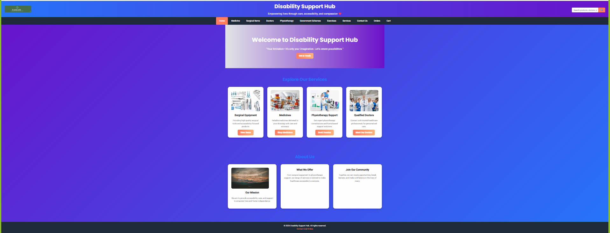

<!-- AIGNITE Banner (centered) -->

  <h1> AIGNITE 2K25</h1>
  
<strong>Powered by MLSC</strong>

---

  <strong>🚀 EnableLife: A Unified Healthcare & Disability Support Platform</strong> 
  <em>A The hub for medicine, doctors, and essential disability services in one place</em>

---

## 📖 Project Description
✨ **Problem Statement: A unified platform to connect people with disabilities to essential services, including medicine, surgical supplies, and professional healthcare bookings.

💡 **Proposed Solution: We transitioned the project from mock client-side data to a functional, modular Node.js/Express backend API, implementing secure authentication (JWT), increasing product stock to 500 across the inventory, and enabling real-time stock-checked order processing.

🎯 **Target Users / Use Cases: Concise: 

=> Users with Mobility Challenges: Who can easily order necessary surgical items (e.g., wheelchairs, crutches) and medications directly to their home.

=> Caregivers and Family Members: Who can efficiently book doctors, physiotherapy, or home nursing services on behalf of the patient.

=> Individuals Seeking Mental Health Support: Who can access and book sessions with counselors and psychologists online or in-person.

=> Patients Requiring Diagnostics: Who can book at-home lab tests (e.g., blood, sugar, thyroid tests) for convenience and manage their history.

=> Anyone Needing Daily Assistance: Who can book services for help with daily activities like mobility support, cleaning, or grocery runs.

---

## 🔬 Methodology
1. **Research & Ideation** –  Our process involved Research & Ideation (problem understanding).  
2. **Design** – Wireframes & Architecture.  
3. **Develop** – Core feature implementation & API integration.  
4. **Test** – Unit/integration validation and user feedback  
5. **Deploy** – Hosting a demo and metric collection
6. **Future Scope** – Integrate a real-time chat/telemedicine feature for instant doctor consultations, implement personalized government scheme recommendations based on user profiles, and transition the current mock database to a persistent SQL/NoSQL database for enhanced scalability and data integrity..

---

## 👥 Team Details
**Team Name:** `Team Enable`

| Name | Role | Email |
|---|---:|---|
| Ritvic Raj | Team Lead | 2511cs020660@mallareddyuniversity.ac.in |
| Diwakar Reddy | Team Member| 2511cs020674@mallareddyuniversity.ac.in |
| Nishitha | Team Member | 2511cs020676@mallareddyuniversity.ac.in |
| Vinisha | Team Member | 2511cs020680@mallareddyuniversity.ac.in |

---

## 🛠️ Technology Stack
`HTML` | `CSS` | `Js` | `Youtube Embeds` | `Node.js` | `Express.js` |

---

## 📹 Demonstration Video
▶️ [YouTube / Google Drive Link](#)

---

## 🌐 Deployment
🔗 [Live Demo Link](#https://drive.google.com/file/d/1-RdSBf1mx8dsUMi22_TVm0-_z3orIfHb/view)

---

## 📚 References
- Apollo 24/7  
- Apollo Homecare  
- Apollo Transport Services

---

## 🖼️ Assets / Screenshots

   
  

---

  <b>Hackathon:</b> AIGNITE 2K25 | Organized by MLSC 

